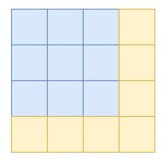

 
    
        MatrixDb
    

## About
- Extended [SimpleRA](https://github.com/SimpleRA/SimpleRA) to allow storing and processing large matrices with teammate Rohan as part of course(Database Systems) project.

* ## Page layout for matrices
- Matrices can have rows greater than block size which doesn't allow us to store the rows in blocks in the typical fashion that tables use(offsets based on row size), so to store matrices in pages we follow the submatrix page storage method which dimensionalises each block into a square matrix. Using the image shown below, one block can be thought of as the blue square matrix and the bigger matrix as the input matrix.

    

- Inorder to implement this type of page storage format, we had to modify and add classes for matrix manipulation such as buffermanager, page and other executor files.

* ## CROSS_TRANSPOSE
- Using submatrix storage method for page layout in our memory, we can transpose each block in the matrix and then transpose these blocks relative to each other inorder to take transpose of the whole matrix.

- We use pointers to the matrix pages so that it doesnt exceed memory limilations of 2 blocks and we have 3 pointers, 2(A,B) for the matrix pages to swap and one for temp storage, through this method we ensure only two of these pointers are active at most at any moment, as we iterate row wise through matrix A's blocks we transpose the block and store it in temp and we delete A's memory, then we transpose B's corresponding block and write the swap page to B's corresponding block position which is CxR of A's block position(RxC), after which we write B's block to A's block in the corresponding position and delete the store for both swap and B.

* ## Part 3
- Since the given matrix is spare and full of zeroes it would be a waste of memory to store the zeroes as they are constant, storing a list of the coordinates of the non-zero values of the matrix would be farly optimal and is the COO method of compressing sparse matrices. We can use tablePage to store this list using columns as (x,y,value).
- Since the matrix is stored as a table of coordinates inorder to take transpose of this matrix all we need to do is swap the column names in the table and if we want to print this matrix or do further operations on it we need to sort the table by x first and y.
- External merge sort can be used as input file size could be big.

